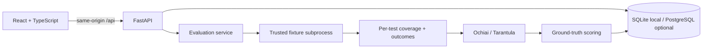

# Architecture

## Request flow

1. The browser fetches the catalog and experiment history.
2. A validated run request selects packaged bug IDs and ranking methods.
3. Each evaluation launches Python with `-I` and a ten-second timeout, passing source and tests through stdin. Ground truth and corrected source are absent from that input.
4. The runner collects executed line numbers with Python tracing. Numeric results use a small comparison tolerance; other values use equality.
5. Coverage counts produce suspiciousness scores. Scoring then looks up the known fault.
6. A complete run is saved as one JSON-backed database record. A runner failure or timeout does not save a partial experiment.
7. The browser displays the returned measured evidence and can export the full record.

## Decisions

- **SQLite locally, SQLAlchemy for both database engines:** quick setup without blocking the PostgreSQL path.
- **Synchronous API work:** enough for six small fixtures; intentionally replaced by a durable worker in milestone 2.
- **Original fixtures:** clean provenance and reproducible failure/fix pairs before importing real-world projects.
- **Two spectrum baselines before LLMs:** verify measurement integrity before introducing prompt, inference, and leakage variables.
- **No arbitrary code execution:** the runner is limited to the trusted packaged catalog. A subprocess timeout is not a sandbox.
- **Single origin:** Vite proxies API requests locally; Nginx does the same in Docker, avoiding broad CORS rules.

## Limits

No authentication, migration framework, pagination beyond the latest 100 runs, or durable jobs yet. Shared hosting requires authentication, rate limits, explicit resource bounds, migrations, and an isolated worker. The Docker/PostgreSQL path is provided but is not validated until a Docker runtime is available. The native SQLite path and browser workflow are tested.
