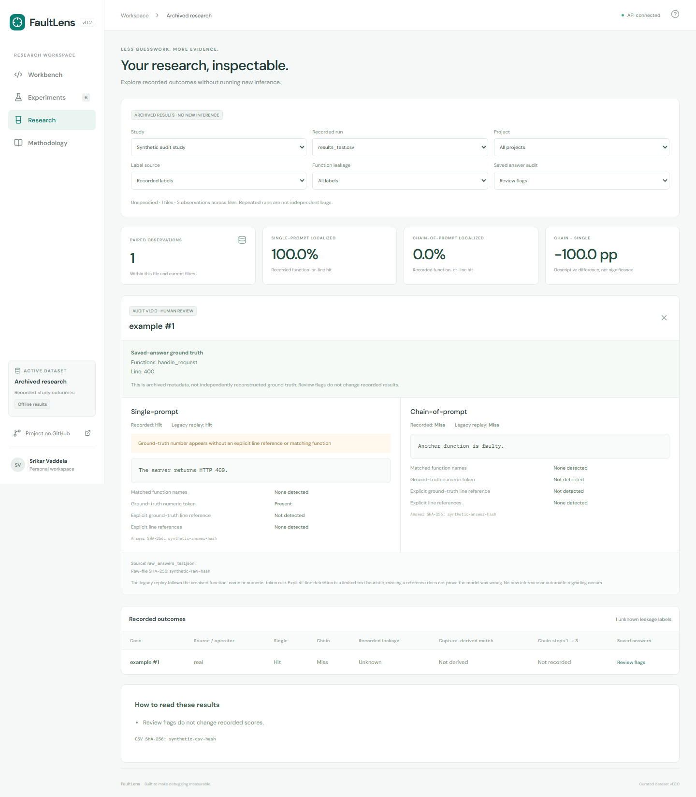

# Offline research imports

FaultLens can inspect archived single-prompt/chain-of-prompt result CSVs without executing archived scripts, making model calls, or requiring upstream project checkouts.

From `backend`, with the virtual environment active:

```shell
python -m app.import_research /path/to/study.zip --name "Research archive"
```

Open **Research** in the workbench. Select a recorded run, project, and function-leakage label to inspect paired outcomes. Imports stay in the ignored local database; no archive, result files, model answers, or upstream source is bundled in the public repository. A ZIP content hash makes repeated imports idempotent. Each CSV retains a content hash, and identical file contents are flagged.

## Metric integrity

`single_localized`/`chain_localized` and legacy `single`/`chain` columns are imported as recorded booleans. These represent the archive's function-or-line localization criterion, not spectrum-based Top-1 or MRR. Recorded scores are never changed. An optional audit replays the archived function-name/numeric-token rule against saved answers for inspection; it does not independently validate ground truth or publish corrected accuracy. Missing outcomes are excluded from the paired accuracy denominator. Invalid boolean values or ambiguous CSV structure fail the import.

Recorded-label filtering uses only explicit `fn_leak` labels. Capture-derived filtering is a separate opt-in view described in [capture leakage methodology](leakage.md). Missing labels are **unknown**, never implicitly clean. Drift-step outcome flags are preserved when present. No significance test pools repeated observations, and overlapping or duplicate files are not automatically combined. Model names inferred from filenames are labeled as inferences; snapshots, latency, usage, and cost remain unavailable unless recorded separately.

## Deliberate limits

The importer reads whitelisted results, final saved answers, and archived capture evidence. It excludes raw prompts, documents, and upstream source. Imported evidence stays local. It does not execute Python in the archive, extract files, or fetch repositories. Capture-derived name-match labels are never promoted to recorded labels or verified historical evidence. Ground-truth reconstruction, verified per-run input lineage, stricter answer scoring, and live inference are later integrations. Schema versions, pairing across repeated passes, and original prompt variants must be defined before claiming the original study has been fully reproduced.

## Saved-answer audit

Importer v2 links `results_<run>.csv` to `raw_answers_<run>.jsonl` by the exact shared filename suffix, then exact project/bug ID. Duplicate case identities are ambiguous and receive no automatic link. Unmatched runs or cases show unavailable answers. Re-importing an archive upgrades a v1 record in place without changing its identity or recorded scores. New imports retain audit version and hashes of the raw file and each original answer. Credential patterns in displayed answers are redacted before persistence; original text is not retained when redacted.

Select **Saved answer audit → Review flags**, then open an answer audit. Both final responses are displayed as plain text alongside archived ground truth, recorded hits, legacy replay, and explicit-line detection. The audit flags unanchored ground-truth numbers, recorded/replayed disagreements, conflicting CSV/raw ground truth, empty answers, and credential redaction. **Next flagged case** moves through the filtered selection.

These flags are limited review heuristics, not evidence that a model was wrong. An incidental numeric match can satisfy the old scorer; an explicit line-reference parser can also miss valid wording. Function matching does not establish whether an answer actually asserts that function is faulty. Ground truth is archived metadata, not newly reconstructed source truth. No new model calls, leakage classification, significance claims, or automatic regrading occur.


